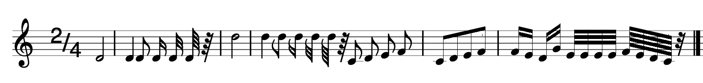

mxml2html
=========

Transform [MusicXML](https://www.musicxml.com/) into HTML directly in a browser.
Goals:
* Easy music sharing - all music editors can export into MusicXML
* Online editing

Demo
----

See MusicXML samples and their HTML + CSS rendering in [test/testcase](https://htmlpreview.github.io/?https://github.com/pavelstudeny/mxml2html/blob/master/test/testcase/index.html#1).

FAQ
---

**How does it work?**
> mxml2html uses XSLT and [Bravura / MusicaD.ttf](https://github.com/steinbergmedia/bravura/releases) font with CSS to position the UNICODE note charaters.

**Google is deprecating native XSLT**
> Yes, XSLTProcessor is [scheduled for removal in 2026](https://developer.chrome.com/docs/web-platform/deprecating-xslt).
> Luckliy, there are [JavaScript implementations](https://github.com/DesignLiquido/xslt-processor) fullfilling the same standards and with a great performance.

**How about MNX?**
> Is is definitelly possibly to transfrom JSON-based [MNX](https://w3c-cg.github.io/mnx/docs/) in a similar way.

**What is the project status?**
> mxml2html keeps expanding the feature set of _timewise_ MusicXML 4.
> XSLT to transfrom older MusicXML versions and _partwise_ into _timewise_ MusicXML 4 [are available](https://www.musicxml.com/for-developers/musicxml-xslt/).

**How can I contribute?**
> Designers or CSS experts have probably already noticed several imperfections. Fixes are welcome.
> Developers can add features via pull requests
> Product managers, any data on what musicians need would be greatly apprecited.
